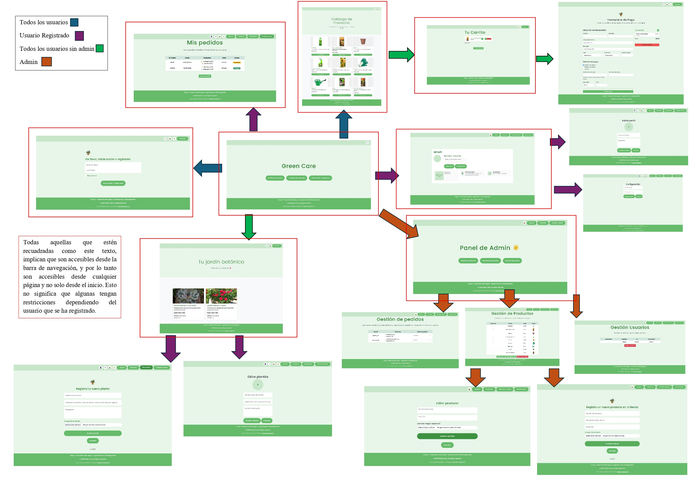

## 👥 Miembros del Equipo
| Nombre y Apellidos | Correo URJC | Usuario GitHub |
|:--- |:--- |:--- |
| Nerea Blázquez | n.blazquez.2024@alumnos.urjc.es  | Nereablz |
| Inés Sebastián | i.sebastian.2024@alumnos.urjc.es | iness-1810 |
|  Sara García   | s.garcial.2024@alumnos.urjc.es   | SGL23 |
| Camila Montero | ci.montero.2022@alumnos.urjc.es | cmont20 |

---

## 🎭 **Preparación: Definición del Proyecto**

### **Descripción del Tema**
Vamos a crear una aplicación sobre plantas y sus cuidados de manera que cualquier usuario pueda acceder a esta información, además los usuarios registrados podrán añadir nuevas plantas, editar su publicación y poder ver sus pedidos realizados. En esta aplicación habrá una tienda en la que podrán comprar productos para las plantas y un carrito de compra.
### **Entidades**
Indicar las entidades principales que gestionará la aplicación y las relaciones entre ellas:

1. **Entidad 1**: Usuario
2. **Entidad 2**: Producto
3. **Entidad 3**: Pedido (carrito de la compra)
4. **Entidad 4**: Plantas
5. **Entidad 5**: Comentarios

**Relaciones entre entidades:**
- Usuario - Pedido: Un usuario puede realizar múltiples pedidos y cada pedido pertenece a un único usuario (1:N)
- Pedido - Producto: Un pedido puede contener varios productos y un producto puede aparecer en muchos pedidos distintos (N:M)
- Usuario - Planta: Un usuario puede registrar múltiples plantas y una planta pertenece a un usuario (N:1)
- Usuario - Comentarios: un usuario puede escribir múltiples comentarios y un comentario pertenece a un único usuario(1:N)

### **Permisos de los Usuarios**
Describir los permisos de cada tipo de usuario e indicar de qué entidades es dueño:

* **Usuario Anónimo**: 
  - Permisos:
      - Visualizar el catálogo de plantas disponible para un usuario anónimo
      - Visualizar el catálogo de productos
      - Realizar pedidos de productos
      - Registrarse
      - Loguearse
  - Es dueño de su pedido

* **Usuario Registrado**: 
  - Permisos:
      - Gestionar su perfil
      - Ver y gestionar sus propias plantas (cada usuario solo puede ver sus propias plantas)
      - Realizar pedidos de productos
      - Ver el historial de sus pedidos
  - Es dueño de:
      - Su perfil de usuario
      - Sus plantas
      - Sus propios pedidos

* **Administrador**: 
  - Permisos:
      - Gestión completa del catálogo de productos
      - Gestión de usuarios
      - Visualización y gestión de todos los pedidos
  - Es dueño de:
      - Los productos
      - Todos los pedidos
      - Todos los usuarios

### **Imágenes**
Indicar qué entidades tendrán asociadas una o varias imágenes:

- **[Entidad con imágenes 1]**: Usuario - Una imagen de avatar por usuario
- **[Entidad con imágenes 2]**: Planta - Una imagen o varias imágenes por planta
- **[Entidad con imágenes 3]**: Producto - Una imagen por producto

---

## 🛠 **Práctica 1: Maquetación de páginas con HTML y CSS**

### **Vídeo de Demostración**
📹 **[Enlace al vídeo en YouTube](https://youtu.be/bpeHyIqIuOU)**
> Vídeo mostrando las principales funcionalidades de la aplicación web.

### **Diagrama de Navegación**
Diagrama que muestra cómo se navega entre las diferentes páginas de la aplicación:



> Hay páginas que accedes dependiendo del nivel de autorización que tenga el usuario. Por ejemplo, mis pedidos, solo se accede si eres un usuario registrado, al igual que las subpáginas para editar las plantas y subir una nueva planta, además de la posibilidad de visualizar tu perfil y poder modificarlo. Las pantallas del carrito, de pago, y el muestrario de las plantas, son accesibles por todos los usuarios excepto el administrador (admin). El admin es el único que puede acceder al panel del admin y como consecuencia a la gestión de pedidos, usuarios y productos, teniendo esta última una opción para agregar nuevos productos y otra para editarlos. Las únicas pantallas que puede navegar todos los usuarios son la de registro (o cambio de usuario) y la de productos.

### **Capturas de Pantalla y Descripción de Páginas**

#### **1. Página Principal / Home**


> Página de inicio que muestra el nombre de la aplicación Green Care y ofrece accesos directos al catálogo de plantas, al catálogo de productos y a las opciones de inicio de sesión y registro. Incluye una barra de navegación únicamente con la opción de ver su pedido (por ser un usuario sin registrarse) y un pie de página, permitiendo al usuario navegar entre las principales secciones de la aplicación

#### **2. Página de inicio de sesión**


> Página que permite al usuario introducir su correo electrónico y contraseña para iniciar sesión o registrarse en la aplicación. Incluye un formulario con campos de email, contraseña y una opción de recordarme. Tras enviar los datos, el usuario es redirigido a la página principal con su sesión iniciada. La pantalla incluye barra de navegación y pie de página para acceder al resto de secciones de la aplicación.

#### **3. Catálogo de plantas - Usuario No Registrado**


> Página que muestra un catálogo de plantas de ejemplo, donde se presentan distintas plantitas con su imagen, nombre, descripción, frecuencia de riego y valoración mediante estrellas. En este modo, el usuario no autenticado solo puede visualizar las plantas disponibles, sin opciones de edición, creación, eliminación ni subida de imágenes. La página incluye barra de navegación y pie de página para acceder al resto de secciones de la aplicación

#### **4. Catálogo de productos**


> Página que muestra un catálogo de productos para el cuidado de las plantas, donde cada producto incluye su imagen, nombre, descripción y precio. Desde esta pantalla, tanto los usuarios registrados como los no registrados pueden añadir productos al carrito de compra mediante el botón correspondiente. La página incluye barra de navegación y pie de página, permitiendo acceder al resto de secciones de la aplicación.

#### **5. Carrito de la compra**


> Página que muestra los productos añadidos al carrito, indicando para cada uno su nombre, precio y cantidad. Desde esta pantalla, el usuario puede incrementar o disminuir unidades, eliminar productos y visualizar el precio total de la compra. Incluye un botón para proceder al pago, esta página es accesible tanto para usuarios autenticados como no autenticados y presenta barra de navegación y pie de página para acceder al resto de la aplicación.

#### **6. Pago**


> Página que permite al usuario revisar los productos del carrito junto con su cantidad y precio total, y completar un formulario de facturación con sus datos personales y de envío. Incluye la selección del método de pago y los campos necesarios para realizar el pago. Desde esta pantalla, el usuario puede volver al carrito o finalizar la compra, tanto si está registrado como si no lo está.

#### **7. Página de inicio para usuario registrado**


> Página de inicio para usuarios autenticados. Muestra el nombre de la aplicación y botones de acceso directo al catálogo de plantas y al catálogo de productos. Las opciones de inicio de sesión y registro se ocultan, mientras que los accesos a funciones de usuario como “Mis pedidos” y perfil están visibles en la barra de navegación. Incluye barra de navegación y pie de página con elementos adaptados según el estado de login y rol del usuario

#### **8. Catálogo de plantas - Usuario Registrado**


> Página que muestra el jardín personal del usuario, donde se listan sus plantas registradas en forma de tarjetas con imágenes, nombre, descripción, frecuencia de riego y valoración. Desde cada tarjeta, el usuario puede marcar plantas como favoritas, eliminarlas, subir nuevas fotos o editar su información. Además, se incluye una tarjeta para añadir nuevas plantas al catálogo personal. La pantalla dispone de barra de navegación y pie de página para acceder al resto de funcionalidades de la aplicación.

#### **9. Editar planta**


> Esta página permite al usuario actualizar sus datos asociados a sus plantas. Incluye la posibilidad de cambiar la foto de la planta, modificar el nombre de la planta, añadir información adicional relevante (como cuidados, días de riego, tipo de abono) y actualizar la descripción. Los cambios se pueden guardar con el botón Guardar cambios o cancelar la edición para volver al catálogo de plantas. Mantiene la barra de navegación y pie de página con opciones visibles según el estado de login.

#### **10. Pedidos del usuario**


> Pantalla que permite al usuario consultar el historial de sus compras. Muestra una tabla con el número de pedido, fecha, productos comprados, total y estado del pedido (procesando, entregado, etc.). Incluye un botón para volver al perfil del usuario y mantiene la barra de navegación y pie de página con opciones visibles según el estado de login.

#### **11. Perfil del usuario**


> Pantalla que muestra la información personal del usuario, incluyendo nombre, foto de perfil y descripción. Permite editar el perfil, añadir nuevas plantas al catálogo personal y acceder a la gestión de pedidos. Mantiene la barra de navegación y pie de página con las opciones visibles según el estado de login.

#### **12. Editar perfil del usuario**


> Pantalla que permite al usuario actualizar su información personal, incluyendo nombre, foto de perfil y descripción. Dispone de campos editables y botones para guardar los cambios o cancelar y volver al perfil. Mantiene la barra de navegación y pie de página con opciones visibles según el estado de login.

#### **13. Configurar usuario**


> Pantalla que permite al usuario cambiar su contraseña y su email. Dispone de campos editables y botones para guardar los cambios o cancelar y volver al perfil. Mantiene la barra de navegación y pie de página con opciones visibles según el estado de login.

#### **14. Registrar nueva planta**


> Pantalla que permite al usuario registrar una nueva planta en su jardín personal. Incluye campos para nombre, cuidados específicos, descripción y subida de imagen de la planta. Dispone de botones para guardar la nueva planta o cancelar y volver al catálogo. Mantiene la barra de navegación y pie de página con opciones visibles según el estado de login.

#### **15. Página de inicio para administrador**


> Página de inicio para usuarios con permisos de administrador. Muestra las opciones principales del sistema, pero oculta elementos que no son necesarios para el admin, como carrito, catálogo de plantas y perfil de usuario. Incluye la barra de navegación y pie de página con las opciones visibles según el estado de login y privilegios de administrador por eso se agrega la opción de admin panel.

#### **16. Catálogo de productos para administrador**


> Página que muestra todos los productos disponibles con su imagen, nombre, descripción y precio. Para administradores, se ocultan los botones de “Añadir al carrito”, dejando visible únicamente la información de los productos. Incluye barra de navegación y pie de página con opciones ajustadas según los permisos de administrador.

#### **17. Panel de Administrador**


> Pantalla principal del administrador donde se accede a las distintas áreas de gestión: usuarios, productos y pedidos. Incluye barra de navegación y pie de página con opciones ajustadas según los permisos de administrador.

#### **18. Gestión de usuarios**


> Pantalla que permite al administrador visualizar y gestionar todos los usuarios registrados en el sistema. Incluye una tabla con la información básica de cada usuario como el nombre, ID y link al perfil y opciones para seleccionar y eliminar usuarios. Incluye barra de navegación y pie de página con opciones ajustadas según los permisos de administrador.

#### **19. Gestión de productos**


> Pantalla que permite al administrador visualizar, añadir, editar o eliminar productos del catálogo de la tienda. Incluye una tabla con información básica de cada producto (nombre, precio e imagen) y checkboxes para selección múltiple. Incluye barra de navegación y pie de página con opciones ajustadas según los permisos de administrador.

#### **20. Registrar nuevo producto**


> Página que contiene un formulario que permite al administrador registrar un nuevo producto en la tienda. Incluye campos para el nombre, descripción, precio e imagen del producto. Dispone de botones para guardar los cambios o cancelar y volver al catálogo de productos. Incluye barra de navegación y pie de página con opciones ajustadas según los permisos de administrador.

#### **21. Editar producto**


> Página que contiene un formulario que permite al administrador modificar los datos de un producto existente en la tienda. Se pueden actualizar el nombre, el precio y, de manera opcional, la imagen del producto. Incluye botones para guardar los cambios o cancelar y volver a la pantalla de gestión de productos. Incluye barra de navegación y pie de página con opciones ajustadas según los permisos de administrador.

#### **22. Gestión de pedidos**


> Página del administrador donde se visualizan todos los pedidos realizados por los usuarios. Muestra el nombre del usuario, los productos pedidos (con cantidad) y permite actualizar el estado del pedido mediante un selector desplegable (En proceso, Enviado, Entregado). Incluye barra de navegación y pie de página con opciones ajustadas según los permisos de administrador.

### **Participación de Miembros en la Práctica 1**

#### **Alumno 1 - Inés Sebastián Santamaría**

Al principio me encargaba de la página de inicio sesión junto con toda la lógica de detrás. Según fue evolucionando el proyecto y con ello las necesidades del mismo, se fueron asignando más responsabilidades, como el catálogo para observar las plantas del usuario o la página para poder gestionar a los usuarios. También cree el código de detrás del header y el footer global, de manera que se imprimeran con solo poner el id. Por último también me encargé del header en si, los estilos, los botones ... Además del código necesario para ir ocultando los paneles en la navegación según que usuario se registraba y la página donde estaba. 

| Nº    | Commits      | Files      |
|:------------: |:------------:| :------------:|
|1| [Aquí ya conseguí que el header fuera global y se incluyera en otros documentos con solo poner el id header-global](https://github.com/DWS-2026/project-grupo-3/commit/05ecf4aa845443b312b485d6a896608196f2eb68) | [Header_global](https://github.com/DWS-2026/project-grupo-3/blob/main/html/header.html)   |
|2| [En este momento fijé el estilo de la página para iniciar sesión y lo moví a un archivo externo css, quedando más bonito el código y asentando las bases para futuras modificaciones](https://github.com/DWS-2026/project-grupo-3/commit/ce1fca407e3d33c27ffca1ef3e32027bc1b9d70d) | [Sign-in](https://github.com/DWS-2026/project-grupo-3/blob/main/html/sign-in.html)   |
|3| [En este commit se creó el catálogo de plantitas, asentando la base del html y permitiendo posteriormente que editara el html para configurarse según el usuario que visitaba la página](https://github.com/DWS-2026/project-grupo-3/commit/2de46f354d1bf9a72fe7657294c9107965d617cd) | [Catálogo_de_plantas](https://github.com/DWS-2026/project-grupo-3/blob/main/html/catalogoPlantas.html)  |
|4| [Con este commit tenemos una pantalla de gestión de usuarios](https://github.com/DWS-2026/project-grupo-3/commit/0b816628f24c9a4e17b5f475b3aca776a2ca9d2b) | [Gestion_de_usuarios](https://github.com/DWS-2026/project-grupo-3/blob/main/html/gestionUsuarios.html)   |
|5| [También una parte muy importante de mi aportación fue unificar los estilos para que todo quedara uniforme y no se repitiera código innecesario, sobretodo esto se puede ver en el css para los forms](https://github.com/DWS-2026/project-grupo-3/commit/db93e8647590dab7c3bf32db9800379a25d6f1ea)  | [Forms_general](https://github.com/DWS-2026/project-grupo-3/blob/main/assets/css/forms-general.css)  |

---

#### **Alumno 2 - Sara García Lopo**

Me he encargado de la página de perfil del usuario, la sección de edición del perfil y la configuración del perfil, encargándome de la maquetación, los estilos visuales y la organización del contenido. Además, he aplicado principios de diseño responsive para asegurar una correcta visualización en distintos dispositivos, como estilos para mejorar la usabilidad y la experiencia del usuario.

| Nº    | Commits      | Files      |
|:------------: |:------------:| :------------:|
|1| [Añadir las funcionalidades de editar y publicar](https://github.com/DWS-2026/project-grupo-3/commit/c62529b165b5b33cd927112e6a1821cae8e3f2cb#diff-283e184f66f273bc8dbb436c152027dbcc3b0842891ff43fb9d91054c43e2424)  | [editProfile.html](https://github.com/DWS-2026/project-grupo-3/blob/main/html/editProfile.html)   |
|2| [Añadir funciones a la pagina del perfil para poder ver pedidos y añadir planta](https://github.com/DWS-2026/project-grupo-3/commit/5d54176af6329c7b8a6d5c1501db76f991178370#diff-604ee7395973716cdf9c4cacf305fb0dca839dc52697b7920e631a71a4352b50)  | [user.html](https://github.com/DWS-2026/project-grupo-3/blob/main/html/user.html)   |
|3| [Eliminar el botón de Publicar para cambiarlo por configuración](https://github.com/DWS-2026/project-grupo-3/commit/4ad7b789bb3bc6a6e724476bb13abc7a61b9e62e)  | [user.html](https://github.com/DWS-2026/project-grupo-3/blob/main/html/user.html)   |
|4| [Cambiar botón para cambiar la foto de perfil](https://github.com/DWS-2026/project-grupo-3/commit/067d5faca35221e4f803ca88667b90ee632e3506)  | [configuration.html](https://github.com/DWS-2026/project-grupo-3/blob/main/html/configuration.html)   |
|5| [Añadí una sección para poder cambiar el correo y la contraseña](https://github.com/DWS-2026/project-grupo-3/commit/14b3284416dd1efeac7b1e0380f0738b361e359c)  | [configuration.html](https://github.com/DWS-2026/project-grupo-3/blob/main/html/configuration.html)   |

---

#### **Alumno 3 - Camila Montero Huerto**

Me he encargado de desarrollar la parte relacionada con la tienda: desde el catálogo de productos hasta el proceso de compra, pasando por el carrito y la página de pago. Además, también implementé la sección de gestión de productos para administrador, la página para añadir una planta y la página donde se puede ver los pedidos del usuario y este pueda gestionarlos. 

| Nº    | Commits      | Files      |
|:------------: |:------------:| :------------:|
|1| [Implementación del catálogo de productos con su respectiva hoja de estilos](https://github.com/DWS-2026/project-grupo-3/commit/da40203b2d72491a667250e82b66ac17ec9cb4f6)  | [catalogoProductos.html](https://github.com/DWS-2026/project-grupo-3/blob/main/html/catalogoProductos.html)   |
|2| [Implementación del carrito de la compra con su respectiva hoja de estilos](https://github.com/DWS-2026/project-grupo-3/commit/da40203b2d72491a667250e82b66ac17ec9cb4f6)  | [carroCompra.html](https://github.com/DWS-2026/project-grupo-3/blob/main/html/carroCompra.html)   |
|3| [Implementación de la página de pago con su respectiva hoja de estilos](https://github.com/DWS-2026/project-grupo-3/commit/69bd7bce3618cee67dd563b2da63de0b2a25a705)  | [pago.html](https://github.com/DWS-2026/project-grupo-3/blob/main/html/pago.html)   |
|4| [Implementación de la página de gestión de productos](https://github.com/DWS-2026/project-grupo-3/commit/3198054889ff51182e990e812d877f9bebcefce3)  | [gestionProductos.html](https://github.com/DWS-2026/project-grupo-3/blob/main/html/gestionProductos.html)   |
|5| [Implementación de la página para añadir una planta](https://github.com/DWS-2026/project-grupo-3/commit/c676e9ee2f9e92e582d2e16e75d33385a35cecf2)  | [nuevaPlanta.html](https://github.com/DWS-2026/project-grupo-3/blob/main/html/nuevaPlanta.html)   |
|6| [Implementación de la página para que el usuario gestione sus pedidos](https://github.com/DWS-2026/project-grupo-3/commit/6206690e759cb8101ac2d8e2fc2307090f5ae313) | [pedidosUsuario.html](https://github.com/DWS-2026/project-grupo-3/blob/main/html/pedidosUsuario.html) |

---

#### **Alumno 4 - Nerea Blázquez Zayas**

He desarrollado la página principal de la aplicación, encargándome de su maquetación y estilos para definir la primera vista del usuario. También ayude a implementar el footer global, asegurando su correcta integración y reutilización en las distintas páginas. Además, participé en el desarrollo del panel de administración, creando el formulario para registrar y editar productos, así como la pantalla de gestión de pedidos, restringiendo su acceso exclusivamente a usuarios con rol de administrador.

| Nº |                                                                                                   Commits                                                                                                    |                                                 Files                                                 |
|:--:|:------------------------------------------------------------------------------------------------------------------------------------------------------------------------------------------------------------:|:-----------------------------------------------------------------------------------------------------:|
| 1  |                     [Implementación final de la página principal y su respectivo CSS](https://github.com/DWS-2026/dws-2026-project-base/commit/4e905e8f29ee5266713b5a57073688044ffe30de)                     |          [index.html](https://github.com/DWS-2026/project-grupo-3/blob/main/html/index.html)          |
| 2  | [Implementación del footer anterior al actual, el cual le hemos quitado información, y su respectivo CSS](https://github.com/DWS-2026/dws-2026-project-base/commit/0c3fb0de3e17858ab1048f739a3917109b3827a8) |                                     [footer.html](https://github.com/DWS-2026/project-grupo-3/blob/main/html/footer.html)                                      |
| 3  |                  [Implementación para crear un nuevo producto desde el panel del admin](https://github.com/DWS-2026/dws-2026-project-base/commit/06ac44fe82576026ba751a4e032698e03dd7419b)                   |  [nuevoProducto.html](https://github.com/DWS-2026/project-grupo-3/blob/main/html/nuevoProducto.html)  |
| 4  |            [Implementación de una pantalla de gestión de los pedidos desde el panel del admin](https://github.com/DWS-2026/dws-2026-project-base/commit/c3d2dc62218fa0c09c54b37e5b904641e3018761)            | [gestionPedidos.html](https://github.com/DWS-2026/project-grupo-3/blob/main/html/gestionPedidos.html) |
| 5  |           [Implementación de una pantalla para la edición del producto desde el panel de admin](https://github.com/DWS-2026/dws-2026-project-base/commit/b480c4ff2a57e429c2772d90e20c5632b40d08f3)           |    [eidtProduct.html](https://github.com/DWS-2026/project-grupo-3/blob/main/html/editProduct.html)    |

---

## 🛠 **Práctica 2: Web con HTML generado en servidor**

### **Vídeo de Demostración**
📹 **[Enlace al vídeo en YouTube](https://www.youtube.com/watch?v=x91MPoITQ3I)**
> Vídeo mostrando las principales funcionalidades de la aplicación web.

### **Navegación y Capturas de Pantalla**

#### **Diagrama de Navegación**

Solo si ha cambiado.

#### **Capturas de Pantalla Actualizadas**

Solo si han cambiado.

### **Instrucciones de Ejecución**

#### **Requisitos Previos**
- **Java**: versión 21 o superior
- **Maven**: versión 3.8 o superior
- **MySQL**: versión 8.0 o superior
- **Git**: para clonar el repositorio

#### **Pasos para ejecutar la aplicación**

1. **Clonar el repositorio**
   ```bash
   git clone https://github.com/[usuario]/[nombre-repositorio].git
   cd [nombre-repositorio]
   ```

2. **AQUÍ INDICAR LO SIGUIENTES PASOS**

#### **Credenciales de prueba**
- **Usuario Admin**: usuario: `admin`, contraseña: `admin`
- **Usuario Registrado**: usuario: `user`, contraseña: `user`

### **Diagrama de Entidades de Base de Datos**

Diagrama mostrando las entidades, sus campos y relaciones:


> [Descripción opcional: Ej: "El diagrama muestra las 4 entidades principales: Usuario, Producto, Pedido y Categoría, con sus respectivos atributos y relaciones 1:N y N:M."]

### **Diagrama de Clases y Templates**

Diagrama de clases de la aplicación con diferenciación por colores o secciones:


> [Descripción opcional del diagrama y relaciones principales]

### **Participación de Miembros en la Práctica 2**

#### **Alumno 1 - Inés Sebastián Santamaría**

[Descripción de las tareas y responsabilidades principales del alumno en el proyecto]

| Nº    |                                                                                      Commits                                                                                       |                                                                                                                                            Files                                                                                                                                             |
|:------------: |:----------------------------------------------------------------------------------------------------------------------------------------------------------------------------------:|:--------------------------------------------------------------------------------------------------------------------------------------------------------------------------------------------------------------------------------------------------------------------------------------------:|
|1|                            [Construir la entidad imágenes](https://github.com/DWS-2026/project-grupo-3/commit/ac6629c4)                            |                                                                                           [Image](https://github.com/DWS-2026/project-grupo-3/blob/main/src/main/java/es/codeurjc/board/model/Image.java)                                                                                            |
|2|                 [Conseguir conectar el proyecto con la base de datos](https://github.com/DWS-2026/project-grupo-3/commit/891ae5a7106975b46c0d23c39060f5ab1d4df902)                 |                                                                                   [Aplication Properties](https://github.com/DWS-2026/project-grupo-3/blob/main/src/main/resources/application.properties)                                                                                   |
|3|                           [Construir la entidad plantitas](https://github.com/DWS-2026/project-grupo-3/commit/9898c3c582cc5ad740872e61ac9e438ab2dd82f0)                            |                                                                                       [Plant](https://github.com/DWS-2026/project-grupo-3/blob/main/src/main/java/es/codeurjc/board/model/Plant.java)                                                                                        |
|4| [Me encargé de configurar los roles y de controlar los accesos a las url, junto con los botones relacionado con ello](https://github.com/DWS-2026/project-grupo-3/commit/f2dd74d6) | [WebSecurityConfig](https://github.com/DWS-2026/project-grupo-3/blob/main/src/main/java/es/codeurjc/board/security/WebSecurityConfig.java) [SessionAttributes](https://github.com/DWS-2026/project-grupo-3/blob/main/src/main/java/es/codeurjc/board/modelAttributes/SessionAttributes.java) |
|5|      [Modificar la edición de las plantas para que se ajuste a la base de datos](https://github.com/DWS-2026/project-grupo-3/commit/15d6777d1724646f3bdedf8f09b7128598d2082e)      |                                                                                    [Edit Plant](https://github.com/DWS-2026/project-grupo-3/blob/main/src/main/resources/templates/Plants/editPlant.html)                                                                                    |

---

#### **Alumno 2 - [Nombre Completo]**

[Descripción de las tareas y responsabilidades principales del alumno en el proyecto]

| Nº    | Commits      | Files      |
|:------------: |:------------:| :------------:|
|1| [Descripción commit 1](URL_commit_1)  | [Archivo1](URL_archivo_1)   |
|2| [Descripción commit 2](URL_commit_2)  | [Archivo2](URL_archivo_2)   |
|3| [Descripción commit 3](URL_commit_3)  | [Archivo3](URL_archivo_3)   |
|4| [Descripción commit 4](URL_commit_4)  | [Archivo4](URL_archivo_4)   |
|5| [Descripción commit 5](URL_commit_5)  | [Archivo5](URL_archivo_5)   |

---

#### **Alumno 3 - [Nombre Completo]**

[Descripción de las tareas y responsabilidades principales del alumno en el proyecto]

| Nº    | Commits      | Files      |
|:------------: |:------------:| :------------:|
|1| [Descripción commit 1](URL_commit_1)  | [Archivo1](URL_archivo_1)   |
|2| [Descripción commit 2](URL_commit_2)  | [Archivo2](URL_archivo_2)   |
|3| [Descripción commit 3](URL_commit_3)  | [Archivo3](URL_archivo_3)   |
|4| [Descripción commit 4](URL_commit_4)  | [Archivo4](URL_archivo_4)   |
|5| [Descripción commit 5](URL_commit_5)  | [Archivo5](URL_archivo_5)   |

---

#### **Alumno 4 - [Nombre Completo]**

[Descripción de las tareas y responsabilidades principales del alumno en el proyecto]

| Nº    | Commits      | Files      |
|:------------: |:------------:| :------------:|
|1| [Descripción commit 1](URL_commit_1)  | [Archivo1](URL_archivo_1)   |
|2| [Descripción commit 2](URL_commit_2)  | [Archivo2](URL_archivo_2)   |
|3| [Descripción commit 3](URL_commit_3)  | [Archivo3](URL_archivo_3)   |
|4| [Descripción commit 4](URL_commit_4)  | [Archivo4](URL_archivo_4)   |
|5| [Descripción commit 5](URL_commit_5)  | [Archivo5](URL_archivo_5)   |

---

## 🛠 **Práctica 3: Incorporación de una API REST a la aplicación web, análisis de vulnerabilidades y contramedidas**

### **Vídeo de Demostración**
📹 **[Enlace al vídeo en YouTube](https://www.youtube.com/watch?v=x91MPoITQ3I)**
> Vídeo mostrando las principales funcionalidades de la aplicación web.

### **Documentación de la API REST**

#### **Especificación OpenAPI**
📄 **[Especificación OpenAPI (YAML)](/api-docs/api-docs.yaml)**

#### **Documentación HTML**
📖 **[Documentación API REST (HTML)](https://raw.githack.com/[usuario]/[repositorio]/main/api-docs/api-docs.html)**

> La documentación de la API REST se encuentra en la carpeta `/api-docs` del repositorio. Se ha generado automáticamente con SpringDoc a partir de las anotaciones en el código Java.

### **Diagrama de Clases y Templates Actualizado**

Diagrama actualizado incluyendo los @RestController y su relación con los @Service compartidos:


#### **Credenciales de Usuarios de Ejemplo**

| Rol | Usuario | Contraseña |
|:---|:---|:---|
| Administrador | admin | admin123 |
| Usuario Registrado | user1 | user123 |
| Usuario Registrado | user2 | user123 |

### **Participación de Miembros en la Práctica 3**

#### **Alumno 1 - [Nombre Completo]**

[Descripción de las tareas y responsabilidades principales del alumno en el proyecto]

| Nº    | Commits      | Files      |
|:------------: |:------------:| :------------:|
|1| [Descripción commit 1](URL_commit_1)  | [Archivo1](URL_archivo_1)   |
|2| [Descripción commit 2](URL_commit_2)  | [Archivo2](URL_archivo_2)   |
|3| [Descripción commit 3](URL_commit_3)  | [Archivo3](URL_archivo_3)   |
|4| [Descripción commit 4](URL_commit_4)  | [Archivo4](URL_archivo_4)   |
|5| [Descripción commit 5](URL_commit_5)  | [Archivo5](URL_archivo_5)   |

---

#### **Alumno 2 - [Nombre Completo]**

[Descripción de las tareas y responsabilidades principales del alumno en el proyecto]

| Nº    | Commits      | Files      |
|:------------: |:------------:| :------------:|
|1| [Descripción commit 1](URL_commit_1)  | [Archivo1](URL_archivo_1)   |
|2| [Descripción commit 2](URL_commit_2)  | [Archivo2](URL_archivo_2)   |
|3| [Descripción commit 3](URL_commit_3)  | [Archivo3](URL_archivo_3)   |
|4| [Descripción commit 4](URL_commit_4)  | [Archivo4](URL_archivo_4)   |
|5| [Descripción commit 5](URL_commit_5)  | [Archivo5](URL_archivo_5)   |

---

#### **Alumno 3 - [Nombre Completo]**

[Descripción de las tareas y responsabilidades principales del alumno en el proyecto]

| Nº    | Commits      | Files      |
|:------------: |:------------:| :------------:|
|1| [Descripción commit 1](URL_commit_1)  | [Archivo1](URL_archivo_1)   |
|2| [Descripción commit 2](URL_commit_2)  | [Archivo2](URL_archivo_2)   |
|3| [Descripción commit 3](URL_commit_3)  | [Archivo3](URL_archivo_3)   |
|4| [Descripción commit 4](URL_commit_4)  | [Archivo4](URL_archivo_4)   |
|5| [Descripción commit 5](URL_commit_5)  | [Archivo5](URL_archivo_5)   |

---

#### **Alumno 4 - [Nombre Completo]**

[Descripción de las tareas y responsabilidades principales del alumno en el proyecto]

| Nº    | Commits      | Files      |
|:------------: |:------------:| :------------:|
|1| [Descripción commit 1](URL_commit_1)  | [Archivo1](URL_archivo_1)   |
|2| [Descripción commit 2](URL_commit_2)  | [Archivo2](URL_archivo_2)   |
|3| [Descripción commit 3](URL_commit_3)  | [Archivo3](URL_archivo_3)   |
|4| [Descripción commit 4](URL_commit_4)  | [Archivo4](URL_archivo_4)   |
|5| [Descripción commit 5](URL_commit_5)  | [Archivo5](URL_archivo_5)   |
